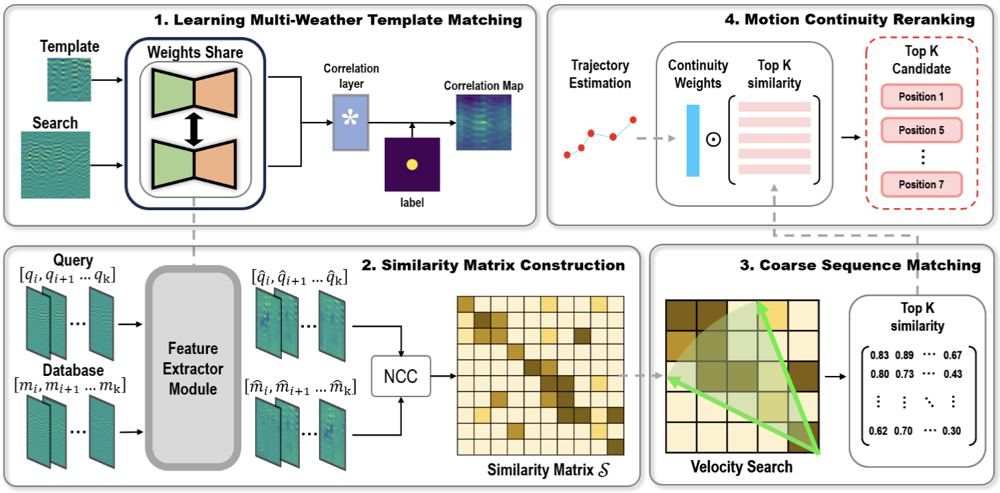

# Looking Beneath More: A Sequence-based Localizing Ground Penetrating Radar Framework

Implementation of SeqLGPR in Python, including code for training the model on the GROUNDED dataset.


## Data

Running this code requires a copy of the GROUNDED dataset (Ort T, Gilitschenski I, Rus D. GROUNDED: A localizing ground penetrating radar evaluation dataset for learning to localize in inclement weather[J]. The International Journal of Robotics Research, 2023, 42(10): 901-916.)


# Usage

`demo.py` contains the majority of the code and selectable parameters which we'll discuss in mode detail below.


## Paper

"Looking Beneath More: A Sequence-based Localizing Ground Penetrating Radar Framework"

If you use this code, please cite:
```
@INPROCEEDINGS{10610174,
  author={Zhang, Pengyu and Zhi, Shuaifeng and Yuan, Yuelin and Bi, Beizhen and Xin, Qin and Huang, Xiaotao and Shen, Liang},
  booktitle={2024 IEEE International Conference on Robotics and Automation (ICRA)}, 
  title={Looking Beneath More: A Sequence-based Localizing Ground Penetrating Radar Framework}, 
  year={2024},
  volume={},
  number={},
  pages={8515-8521},
  keywords={Location awareness;Visualization;Ground penetrating radar;Redundancy;Pipelines;Network architecture;Feature extraction},
  doi={10.1109/ICRA57147.2024.10610174}}
```
